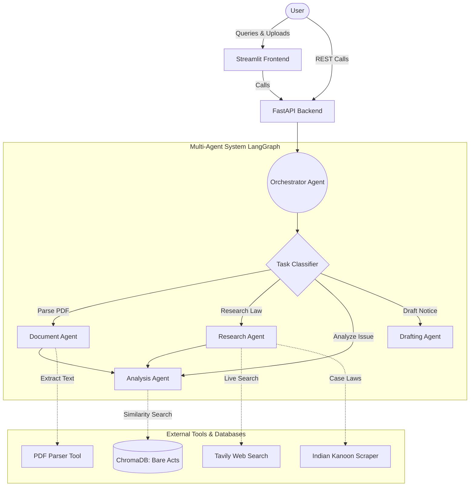

# LegalMind AI — Autonomous Legal Research & Draft Agent

## Description
**LegalMind AI** is a production-grade, multi-agent artificial intelligence system designed specifically for the Indian legal domain. It orchestrates a specialized team of AI agents to autonomously parse legal documents, conduct semantic research against Indian Bare Acts, retrieve relevant case laws, and automatically draft formal legal notices, replies, and contract summaries.

The system utilizes **Retrieval-Augmented Generation (RAG)** over a local vector database (ChromaDB) containing Indian statutory laws, combined with live web-based legal search to ground its analysis in factual precedents and current statutes.

## Tech Stack
- **Core Languages:** Python 3.11+
- **AI & Orchestration:** LangChain, LangGraph, OpenAI (GPT-4o-mini), Tavily API
- **Vector Database (RAG):** ChromaDB, OpenAI Embeddings (text-embedding-3-small)
- **Document Processing:** PyPDFLoader, pdfplumber
- **Backend Infrastructure:** FastAPI, Uvicorn, Pydantic
- **Web Scraping:** Requests, BeautifulSoup4
- **Frontend UI:** Streamlit

## Multi-Agent Architecture

The core of LegalMind AI is powered by LangGraph, routing user inputs to highly specialized agents:

1. **Orchestrator Agent**: Manages the state, classifies the user's task, and routes the workflow to the correct sub-agent.
2. **Document Agent**: Parses uploaded PDFs (contracts, FIRs, notices) and extracts key text reliably.
3. **Research Agent**: Scours general web sources and Indian Kanoon for relevant case laws and acts.
4. **Analysis Agent**: A ReAct-based agent that matches extracted text against IPC, CRPC, and other statutes stored in the ChromaDB vector database.
5. **Drafting Agent**: Auto-generates formal legal notices, replies, and contract summaries using LCEL (LangChain Expression Language) pipelines.

### Architecture Diagram



## Setup & Installation

1. **Clone the repository:**
   ```bash
   git clone https://github.com/anushkagupta200615-jpg/LegalMind-AI.git
   cd LegalMind-AI
   ```

2. **Install dependencies:**
   ```bash
   pip install -r requirements.txt
   ```

3. **Configure Environment:**
   Update the `.env` file with your API keys:
   ```env
   OPENAI_API_KEY=your_openai_key
   TAVILY_API_KEY=your_tavily_key
   ```

4. **Initialize the Vector Database:**
   Place your Bare Act PDFs in the `data/bare_acts/` folder and run the ingestion script:
   ```bash
   python vectordb/ingest.py
   ```

5. **Run the Application:**
   Start the Streamlit UI:
   ```bash
   streamlit run app.py
   ```
   Or start the FastAPI backend:
   ```bash
   python api/main.py
   ```
